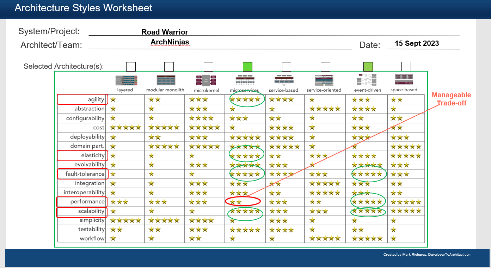
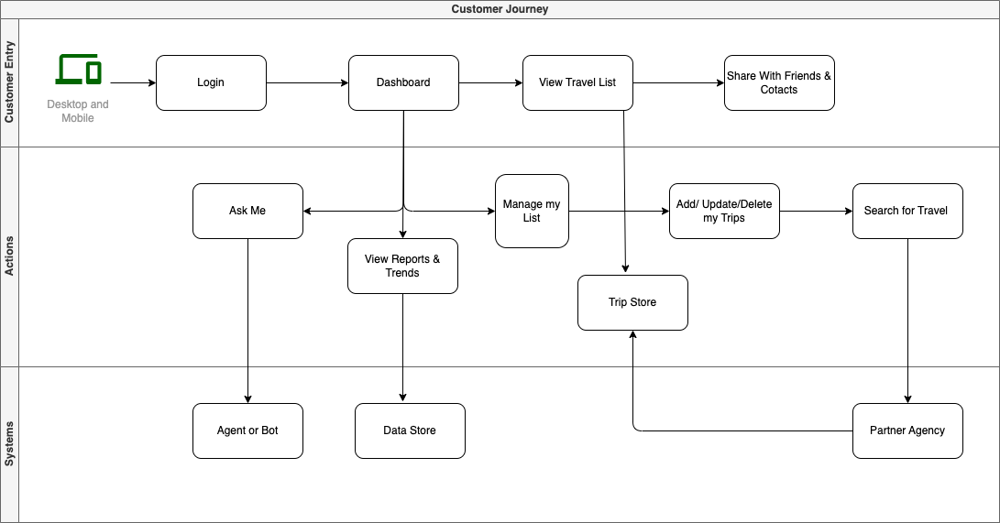
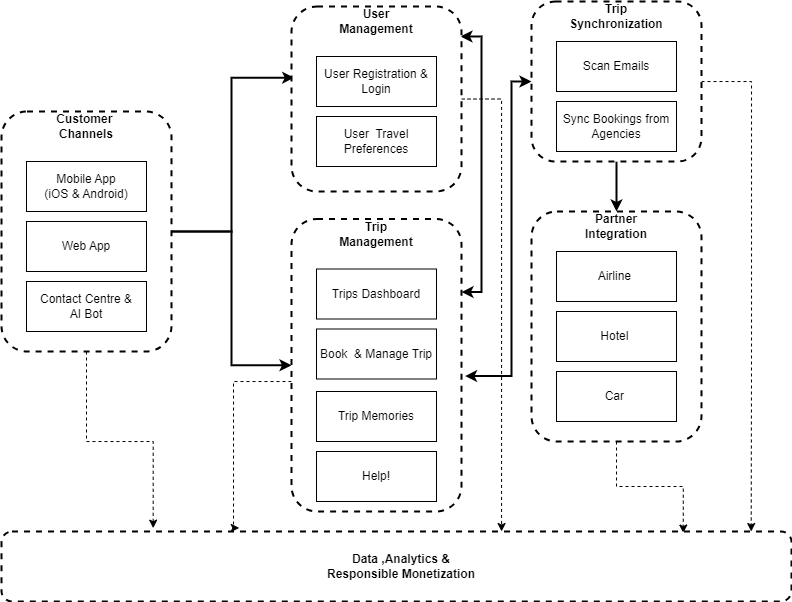
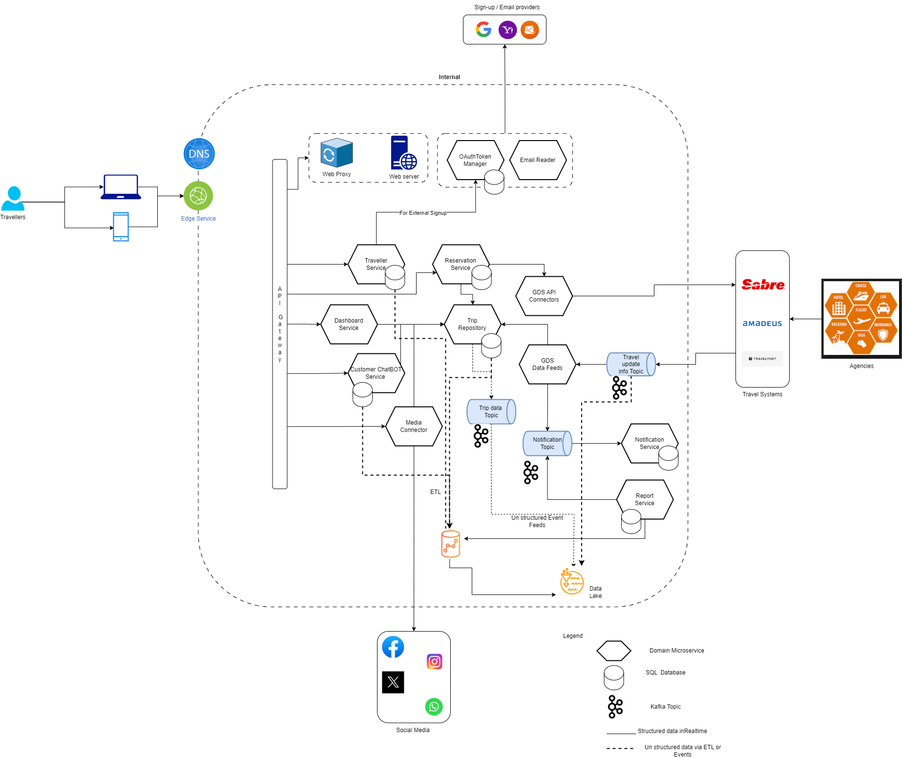

## Repository for Oreilly Arch Kata Competition -2023
<!-- https://github.com/ArchNinjas/road-warrior -->
## ArchNinjas Team :
1. Karthik Thiyagarajan
2. Narendra Paladugu
3. Thahir Ahamed
4. Rahul Upadhye
5. Ramkumar Srinivasan

# Contents 
- [Contents](#contents)
  - [Introduction](#introduction)
    - [Requirements](#requirements)
    - [Constraints](#constraints)
  - [Architecture Characteristics](#architecture-characteristics)
  - [Architecture Approach](#architecture-approach)
  - [Customer Journey](#customer-journey)
  - [Components \& Communication](#components--communication)
  - [Logical Architecture](#logical-architecture)
  - [Deployment Architecture for High Availability](#deployment-architecture-for-high-availability)
  - [Architecture Decision Records](#architecture-decision-records)
  - [Sequence Diagrams](#sequence-diagrams)

## Introduction

Road Warrior is on a mission to transform the way you plan and enjoy travel. As a dynamic and innovative travel management startup, our vision is to rank among the top three travel aggregator apps, offering a comprehensive solution for all your travel requirements.

Road Warrior is meticulously designed to simplify the user experience for booking, itinerary planning, and on road support, all within a single, user-friendly interface on web & mobile. Whether you're pursuing wanderlust, relaxation, or business trip, we've got your travel needs covered.

### Requirements
Richest cross clatform user interface- Mobile & Web. 
Near realtime Synchronized trips booked through the agencies. 
15 mil total users and 2 mil active users per week.Expecting rapid user growth 
As a Startup, start small and scale as needed. 
Architecture must support -
<ul>
      <li>Agility i.e build fast & deploy confidently, ensuring un interrupted service avalability</li>
      <li>Highly Available</li>
      <li>Elasticity i.e </li>
    </ul>
Comprehensive Requirements are avalble at---

### Constraints

As a start up, Road warrior wanted to start small be elastic and dynamic to rollour globally with continuous improvements. In this journey, platform stability, consist user experience on cross platforms and beating the competition with value added services are key all the wihile Road Warrior team also need to be mindful about technology investment yet be ready for elastic scale.

## Architecture Characteristics

The following section highlights significant architecure characteristics and **establishes traceability** between architecture characterstic and requirements.

| Top 5 | Architectural Characteristic                   |  Considerations                                                                                                                                     | Architecture Decisions                                                                                                                                                                                                                                                                                                                                                                                                                                                                               |
|-------|-----------------------------------|----------------------------------------------------------------------------------------------------------------------------------------------------------|------------------------------------------------------------------------------------------------------------------------------------------------------------------------------------------------------------------------------------------------------------------------------------------------------------------------------------------------------------------------------------------------------------------------------------------------------------------------------------------------------|
| - [*] | Availability                      | <ol><li>Road Warrior be available 24/7 for users. </li> <li> Un interrupted Service avaiability even during deployement </li> <li> ~5 min unplanned downtime per month may be allowed</li> </ol> | <ol> <li> System Availability <ul> <li> Choose redundancy to avoid single point of failure (data center) across region </li> <li> Each availability zone has multiple subnets across layers (web, app, persistent) </li> </ul> </li> <li> Service Availability <ul> <li> Containerized platform with autoscaling</li> </ul> </li> <li> Network Availability <ul> <li> Different edge location and available zone to make sure the road warrior is avilable across the globe </li> </ul> </li>  </ol> |
| - [*] | Elasticity                        | 2 million active user base                                                                                                                               | Containerized platform with autoscaling                                                                                                                                                                                                                                                                                                                                                                                                                                                              |
| - [*] | Performance                       | <ol> <li> Response time for web (800ms) </li> <li> First contentful paint of under 1.4sec </li> </ol>                                                    | System Design <ol> <li> Process real-time feed from external systems with Event driven patterns </li> </ol>                                                                                                                                                                                                                                                                                                                                                                                          |
| - [*] | Data consistency & Data Integrity | System to interface with the agencies existing airline, hotel, car rental systems to update travel details                                               | <ol> <li> System Design <ul> <li> Events from external systems are captured in database and retriggered during failure. </li> </ul></li> <li>  Network Design <ol> <li>Different edge location and available zone to make sure the road warrior is avilable across the globe  </li></ol> </li> <ol>                                                                                                                                                                                                  |
| - []  | Responsiveness                    | <ol> <li> Response time for web (800ms) </li> <li> First contentful paint of under 1.4sec </li> </ol>                                                    | <ol> <li> Lazy loading </li> <li> Edge location based CDN components across region. </li> </ol>                                                                                                                                                                                                                                                                                                                                                                                                      |
| - []  | Security                          | Implicit                                                                                                                                                 | <ol> <li> Access control for users </li> <li> Three tier architecture to split public and private subnets. </li> <li> Every interface with external system follows secure VPN design. </li><li> All network calls are SSL enabled. </li> <li> Payload sent/received from external system to be encrypted/decryted. </li> </ol>                                                                                                                                                                       |

## Architecture Approach

Before we take an approach, let's be reminded about the platform goals and constraints. Top 2 golas are 1. Start small and scale as needed 2.Frequent and stable feature releases to be among top three travel apps. Limited funding is a constraint, the platform needs to generate revenue from the acumulated data, ethically and responsibly.

Considering the product goals & constraints, a combination of Microservices architecture & Even Driven Architecture style is considered. Performance may take hit due to inter service communication but it is manageble trade off. Event driven architecture paired with microservices architecture makes the product better performant & resilient. Pefrmance may be further managed by spinning off the additional runtime pods dynamically. See ADR-1 for further details.

## Customer Journey
To-do : Color scheme tomatch other diagrams

## Components & Communication
High Level System Decomposition & Communication Dependency

## Logical Architecture
Component further decomposition to low level. Also depicts the identified domain microservices & their communication

## Deployment Architecture for High Availability
To-Do : Blue-Green deployment for Uninterrupted Servicce, AZ3 needed?, How to deploy Globally , DR database sync

## Architecture Decision Records
  - [ADR-01 - Combination of Microservices & Event Driven Style](Architecture/ADRs/ADR-01-CombinationofMicroservicesArchitecture&EventDrivenStyle.md)
  - [ADR-02 - API Gateway Pattern](Architecture/ADRs/APIGateway.md)
  - [ADR-03 - Network Edge Services for Performance](Architecture/ADRs/ADR-02-NetworkEdgeLocations.md)
  - [ADR-04 - Change Data Capture](Architecture/ADRs/ADR-03-ChangeDataCapture.md)
  - [ADR-05 - Data Consistency & Eventuality](Architecture/ADRs/)
  - [ADR-06 - User Experience- Cross platform Build- React Native](Architecture/ADRs)

## Sequence Diagrams
  - [Book A Trip](SequenceDiagrams/TheRoadWarrior_Sequence_AddTrip.png)
  - [Partner/Agency Integration](SequenceDiagrams/PI-Update.png)
  - [Askme](SequenceDiagrams/Askme.png)

