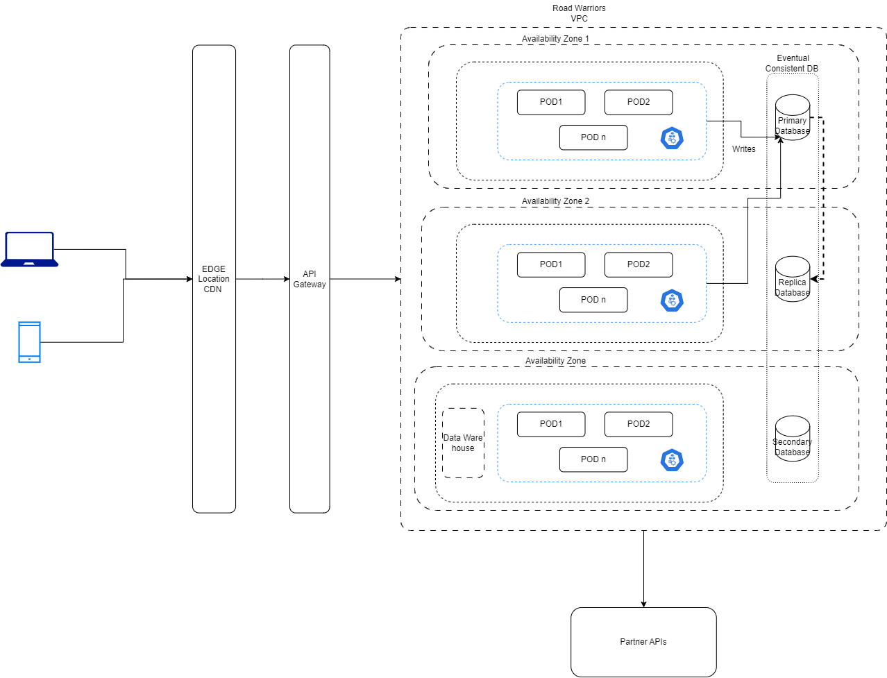

## Repository for Oreilly Arch Kata Competition -2023
<!-- https://github.com/ArchNinjas/road-warrior -->
## ArchNinjas Team :
1. Karthik Thiyagarajan
2. Narendra Paladugu
3. Thahir Ahamed
4. Rahul Upadhye
5. Ramkumar Srinivasan

# Contents 
  - [Introduction](#introduction)
  - [Requirements](#requirements)
  - [Constraints](#constraints)
  - [Architecture Characteristics](#architecture-characteristics)
  - [Architecture Approach](#architecture-approach)
  - [Customer Journey](#customer-journey)
  - [Components \& Communication](#components--communication)
  - [Logical Architecture](#logical-architecture)
  - [Deployment Architecture for High Availability](#deployment-architecture-for-high-availability)
  - [Architecture Decision Records](#architecture-decision-records)
  - [Sequence Diagrams](#sequence-diagrams)

## Introduction

Road Warrior is on a mission to transform the way you plan and enjoy travel. As an innovative travel management startup, our vision is to rank among the top three travel aggregator apps, offering a comprehensive solution for all your travel requirements.

Road Warrior is designed to simplify the user experience for booking, itinerary planning, and on road support, all within a single and user-friendly interface on web & mobile. Whether you're pursuing wanderlust, relaxation, or business trip, we've got your travel needs covered.

### Requirements

- Richest cross clatform user interface- Mobile & Web
- Near realtime synchronized trips booked through the agencies
- With 15 mil total users and 2 mil active users per week, expecting further rapid user growth globally
- Architecture must support:
  - Agility i.e build fast & deploy confidently, ensuring un interrupted service avalability
  - Highly Available (24x7)
  - Elasticity (Evolve & scale as the platform grow )
  - Performance- measured as responsiveness

Comprehensive Requirements are avalble in the provided doc.

### Constraints
As a Startup, start small and scale as needed. We also **assumed** that the solution need to be cost-effective during the initial years

## Architecture Characteristics

The following section highlights significant architecure characteristics and **establishes traceability** between architecture characterstic and requirements.

| Top 5 | Architectural Characteristic                   |  Requirements                                                                                                                                     |  Decisions                                                                                                                                                                                                                                                                                                                                                                                                                                                                               |
|-------|-----------------------------------|----------------------------------------------------------------------------------------------------------------------------------------------------------|------------------------------------------------------------------------------------------------------------------------------------------------------------------------------------------------------------------------------------------------------------------------------------------------------------------------------------------------------------------------------------------------------------------------------------------------------------------------------------------------------|
| - [*] | Availability                      | <ol><li>Road Warrior be available 24/7 for users. </li> <li> Un interrupted service avaiability even during deployement </li> <li> ~5 min un planned downtime per month may be allowed</li> </ol> | <ol> <li> System Availability <ul> <li> Choose redundancy to avoid single point of failure (data center).</li> <li> Each availability zone to have redundant web, app, database & storage </li> </ul> </li> <li> Service Availability <ul> <li> Containerize the workloads to enable service health monitoring & dynamically spinning new service instances and rule-based autoscaling when under load.</li> </ul> </li> <li> Network Availability <ul> <li> Different edge location and available zone to make sure the road warrior is avilable across the globe </li> </ul> </li>  </ol> |
| - [*] | Elasticity                        | 2 million active user base                                                                                                                               | Use Containerized platform with rule base autoscaling                                                                                                                                                                                                                                                                                                                                                                                                                                                              |
| - [*] | Performance                       | <ol> <li> Response time for web (800ms) </li> <li> First contentful paint of under 1.4sec </li> </ol>                                                    | <ol> <li> Cacheable content may be cached close to customer region using Cloud Service Provider's Edge Location Service & apply cache eviction policies </li> <li> Critical components(services) like login,trip booking & trip synchronization have diffrent scaling requirements than the rest of the components. Chosen Microservices Architecture enables us to scale the selective critical services and be cost efficient. </li> </ol>                                                                                                                                                                                                                                                                                                                                                                                          |
| - [*] | Data consistency & Data Integrity | Near raltime trip synchronization from agencies for best user experience.                                               | <ol> <li> System Design <ul> <li> Events from external systems are captured in database and retriggered during failure. </li> </ul></li> <li>  Network Design <ol> <li>Different edge location and available zone to make sure the road warrior is avilable across the globe  </li></ol> </li> <ol>                                                                                                                                                                                                  |
| - []  | Responsiveness                    | <ol> <li> Response time for web (800ms) </li> <li> First contentful paint of under 1.4sec </li> </ol>                                                    | <ol> <li> Lazy loading </li> <li> Edge location based CDN components across region. </li> </ol>                                                                                                                                                                                                                                                                                                                                                                                                      |
| - []  | Security                          | Implicit                                                                                                                                                 | <ol> <li> Access control for users </li> <li> Three tier architecture to split public and private subnets. </li> <li> Every interface with external system follows secure VPN design. </li><li> All network calls are SSL enabled. </li> <li> Payload sent/received from external system to be encrypted/decryted. </li> </ol>                                                                                                                                                                       |

## Architecture Approach

Considering the requirements & significant archtecture charactristics, a combination of Microservices Architecture & Even Driven Architecture style is considered. With Microservices, performance may take hit due to increased inter service communication but it is a manageble trade off. Event driven architecture paired with microservices architecture makes the product better performant & resilient. Pefrmance may be further managed by spinning off the additional runtime service instances dynamically. See ADR-1 for further details.

## Customer Journey
To-do : Color scheme tomatch other diagrams

## Components & Communication
High Level System Decomposition & Communication Dependency

## Logical Architecture
Component further decomposition to low level. Also depicts the identified domain microservices & their communication

## Deployment Architecture for High Availability
To-Do : Blue-Green deployment for Uninterrupted Servicce, AZ3 needed?, How to deploy Globally , DR database sync

## Architecture Decision Records
  - [ADR-01 - Combination of Microservices & Event Driven Style](Architecture/ADRs/ADR-01-CombinationofMicroservicesArchitecture&EventDrivenStyle.md)
  - [ADR-02 - API Gateway Pattern](Architecture/ADRs/APIGateway.md)
  - [ADR-03 - Network Edge Services for Performance](Architecture/ADRs/ADR-02-NetworkEdgeLocations.md)
  - [ADR-04 - Change Data Capture](Architecture/ADRs/ADR-03-ChangeDataCapture.md)
  - [ADR-05 - Data Consistency & Eventuality](Architecture/ADRs/)
  - [ADR-06 - User Experience- Cross platform Build- React Native](Architecture/ADRs)

## Sequence Diagrams
  - [Book A Trip](SequenceDiagrams/TheRoadWarrior_Sequence_AddTrip.png)
  - [Partner/Agency Integration](SequenceDiagrams/PI-Update.png)
  - [Askme](SequenceDiagrams/Askme.png)

